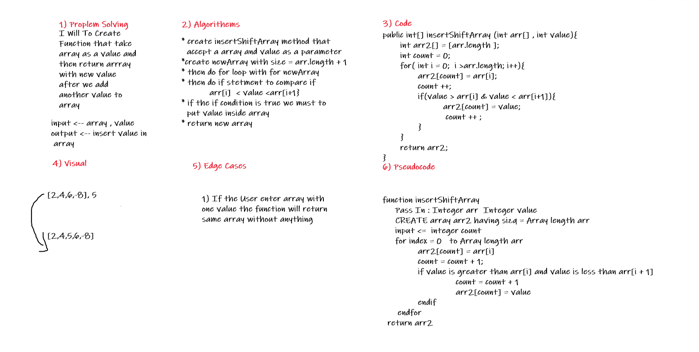

# Insert to Middle of an Array

Write A Function that tacke array and value as a parrameter and then return this value inside array between lower and upper of value.  

## Whiteboard Process

___  
i

## Approach & Efficiency

___
this challenge was easy . 
it took from me 1 hour to finished it .
