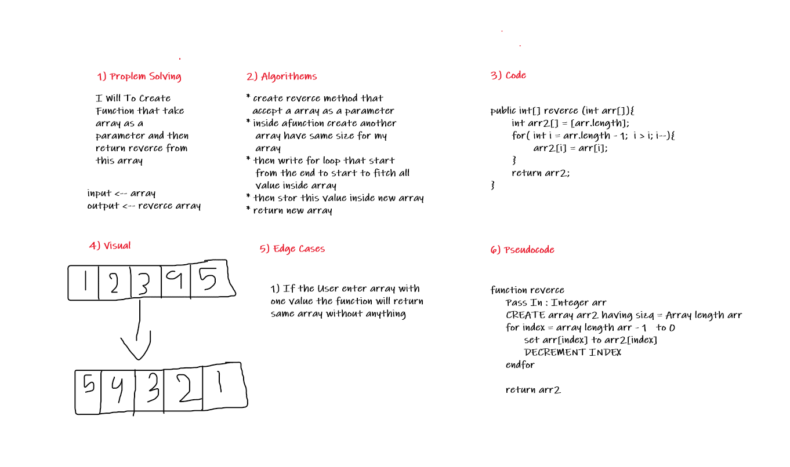

# Reverce Array

Write A Function that tacke array as a parrameter and then return the reverce for this array .  

## Whiteboard Process

___  

## Approach & Efficiency

___
this challenge was easy but because we didn't familiar with this challenge it was little hard.  
it took from me 1 hour to finished it .
