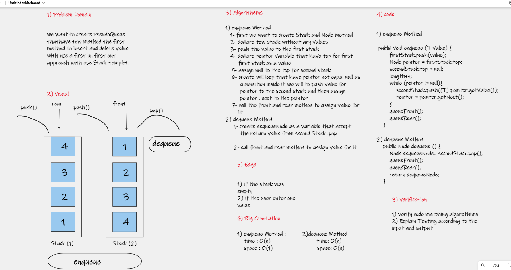

# Challenge Summary

* we want to create PseudoQueue
tha thave tow method(enqueue, dequeue) the first method to insert value with use a first-in, first-out approach with and the second mehtod to delete value with use a first-in, first-out approach ,use Stack templet.

## Whiteboard Process
[Link for whitebord](https://whiteboard.office.com/me/whiteboards/7f2d1572-f9db-4ee1-9f5f-c992d844af37)

## Approach & Efficiency
## Approach 
* the approach that i follw it is create stack and Node classes and then create tow Stack the first stack i will to push data for it and then after it i will to push data to the second stack
* we i want to delete data i will to call the second Stack and then i will to pop value from it

## Efficiency
* enqueue () Big O notation     
    time : O(n).  
    space: O(1).
* enqueue () Big O notation  
    time : O(n).  
    space: O(n).  

## Solution
* ## Example: 
    PseudoQueue pseudoQueue = new PseudoQueue<>();  
        pseudoQueue.enqueue(1);  
        pseudoQueue.enqueue(2);  
    pseudoQueue.enqueue(3);  
    pseudoQueue.enqueue(4);  
    pseudoQueue.enqueue(5);  
    pseudoQueue.enqueue(6);  
    pseudoQueue.enqueue(7);  

    pseudoQueue.printQueue();  
    System.out.println(pseudoQueue.dequeue());  
            System.out.println("__________________________________________________");  
            System.out.println("The Front is : " + pseudoQueue.getFront());  
            System.out.println("The Rear is  : " + pseudoQueue.getRear());  
            pseudoQueue.printQueue();  
            System.out.println("__________________________________________________");  
            System.out.println("The Front is : " + pseudoQueue.getFront());  
            System.out.println("The Rear is  : " + pseudoQueue.getRear());  

* ## output   
    1  
    2  
    3  
    4  
    5  
    6  
    7  
    Node{value=1}  
    __________________________________________________
    The Front is : Node{value=2}  
    The Rear is  : Node{value=7}  
    2  
    3  
    4  
    5  
    6  
    7  
    __________________________________________________
    The Front is : Node{value=2}  
    The Rear is  : Node{value=7}  
