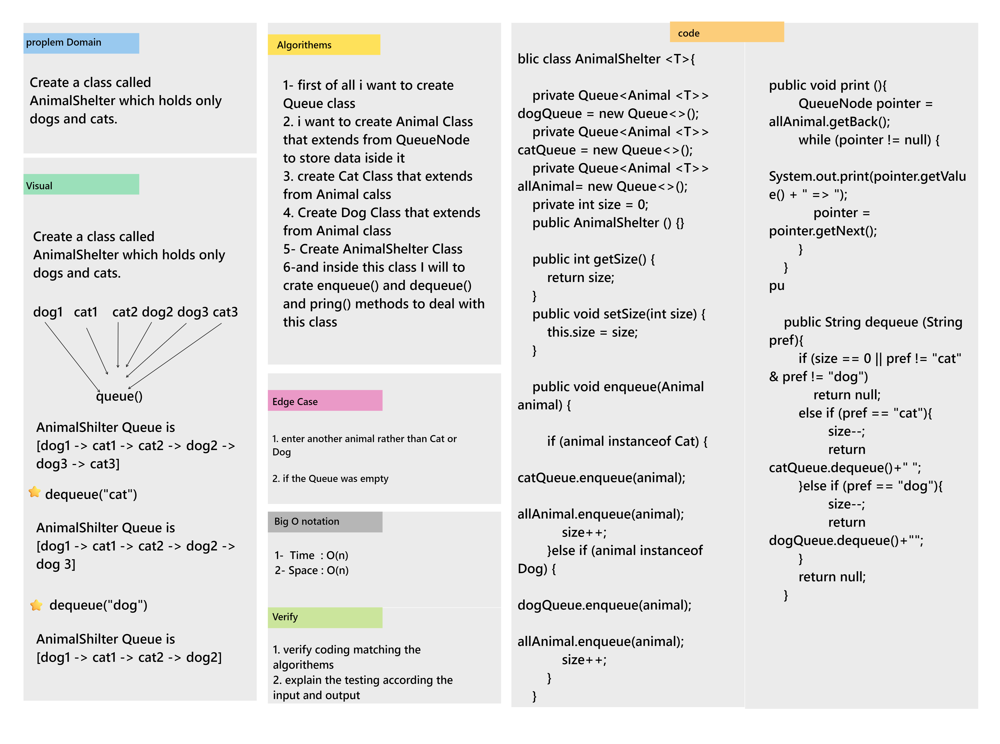

# Challenge Summary
Create a class called AnimalShelter which holds only dogs and cats.

## Whiteboard Process

## Approach & Efficiency

### Big O Notation

- Accorditn to the Queue for evry Calss
* Time : O(n)
* Space: O(n)

## Solution
AnimalShelter animalShelter = new AnimalShelter();  
        animalShelter.enqueue(new Cat("cat1"));  
        animalShelter.enqueue(new Cat("Cat2"));  
        animalShelter.enqueue(new Cat("Cat3"));  
        animalShelter.enqueue(new Dog("dog1"));  
        animalShelter.enqueue(new Dog("dog2"));  
        animalShelter.enqueue(new Dog("dog3"));  
        System.out.println(animalShelter.dequeue("cat")); // cat3   
        System.out.println(animalShelter.dequeue("dog")); // dog3  