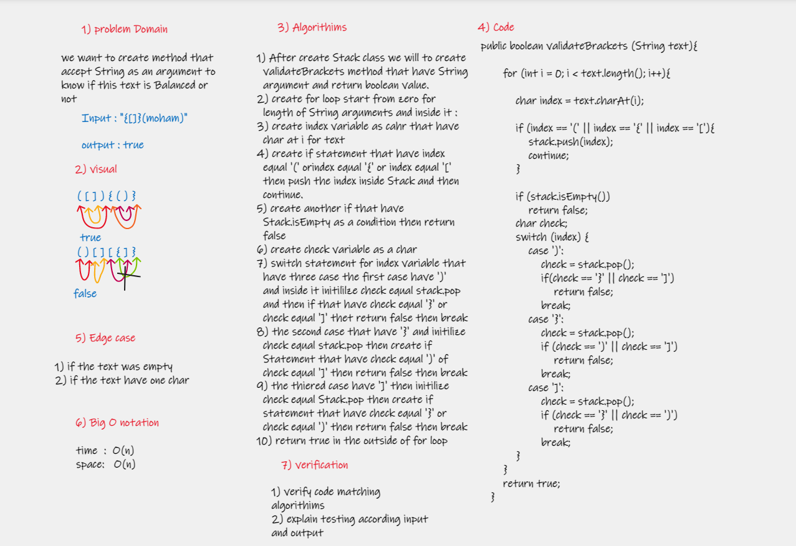

# Challenge Summary
In theis challenge we want to create method that accept String argument to know if this argument is Balanced or not
___
## Whiteboard Process
[WhiteBoard Link](https://whiteboard.office.com/me/whiteboards/7c2a5951-fb8e-43cc-99e2-56805b908c6a)

___
## Approach & Efficiency
* The approach
    create Stack class and then push the brackets for it and then poop this value to check if text is balanced or not
* Big O notation     
    1. Space : o(n)  
    2. Time  : O(n)
___
## Solution
* ### Example :  
    Balanced balanced = new Balanced();  
        String text = "[{}]({})";  
        System.out.println(balanced.validateBrackets(text));  

* ### Output :  
    true
___