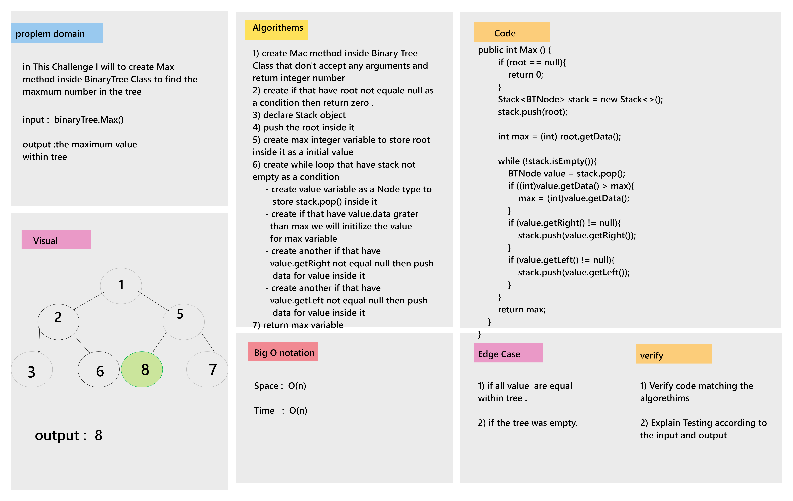

# Challenge Summary

in this challenge I will to create Max function inside BinaryTree class to find the maximum value inide specific tree.
___

## Whiteboard Process

___

## Approach & Efficiency

* Approach : create Max method inside tree class to find the maximum value  
* Big O notation :  
    1. Time  : O(n)  
    2. Space : O(n)  

## Solution

* Example :

  BinaryTree binaryTree = new BinaryTree();  
        binaryTree.setRoot(new BTNode(1));  
        binaryTree.getRoot().setLeft(new BTNode<Integer>(3));  
        binaryTree.getRoot().setRight(new BTNode<Integer>(12));  
        binaryTree.getRoot().getLeft().setLeft(new BTNode<Integer>(6));  
        binaryTree.getRoot().getLeft().setRight(new BTNode<Integer>(7));  
        binaryTree.getRoot().getLeft().getLeft().setLeft(new BTNode<Integer>(9));  

* Output :  
    System.out.println(binaryTree.Max()); // 12

