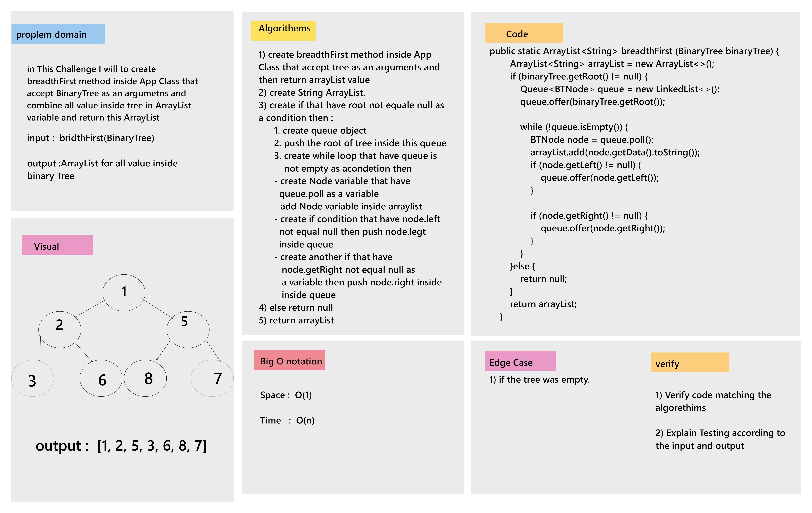

# Challenge Summary

in this challenge I will to create bredthFirst method that accept tree as an argument and return ArrayList value that contains all of the values inside the tree.
___

## Whiteboard Process

___

## Approach & Efficiency

* Approach : create bredthFirst Method inside App class and then return ArrayList that contains all of the value inside tree
* Big O notation :  
    1. Time  : O(n)  
    2. Space : O(1)  

## Solution

* Example :

  BinaryTree binaryTree = new BinaryTree();  
        binaryTree.setRoot(new BTNode(1));  
        binaryTree.getRoot().setLeft(new BTNode<Integer>(3));  
        binaryTree.getRoot().setRight(new BTNode<Integer>(12));  
        binaryTree.getRoot().getLeft().setLeft(new BTNode<Integer>(6));  
        binaryTree.getRoot().getLeft().setRight(new BTNode<Integer>(7));  
        binaryTree.getRoot().getRight().setLeft(new BTNode<Integer>(9));  

* Output :  

    System.out.println(bredthFirst(binaryTree)); // [1, 3, 12, 6, 7, 9]