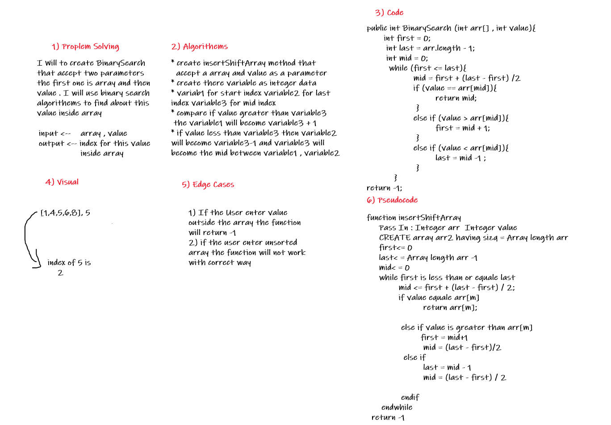

# Insert to Middle of an Array

Write A Function that tacke array and value as a parrameter and then return the index for this value with use 
Binary Search Algorithm.

## Whiteboard Process

___  

## Approach & Efficiency

___
this challenge was easy .
it took from me 1 hour to finished it .
