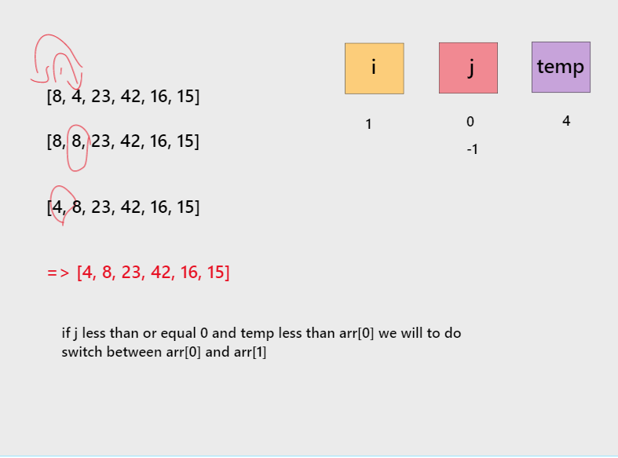
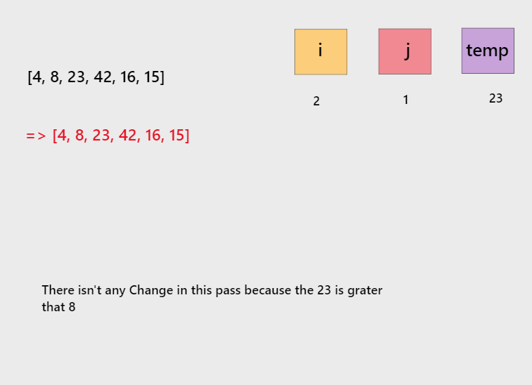
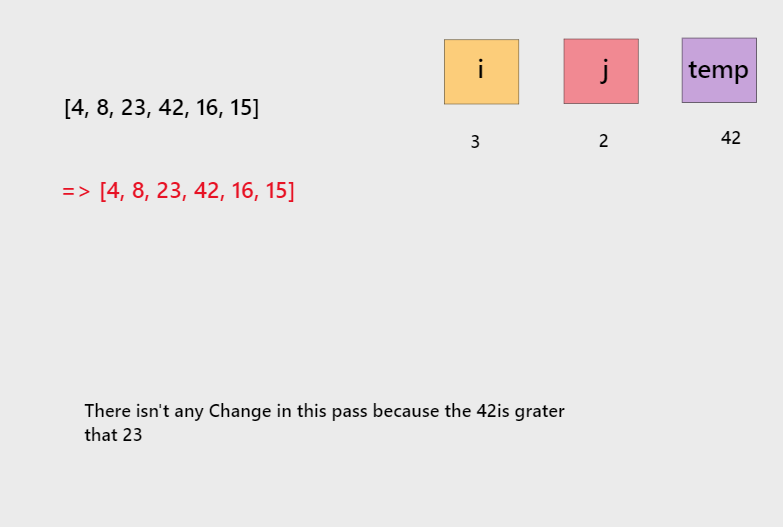
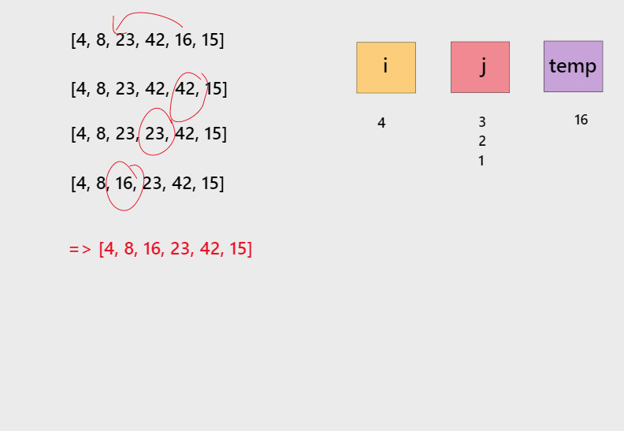
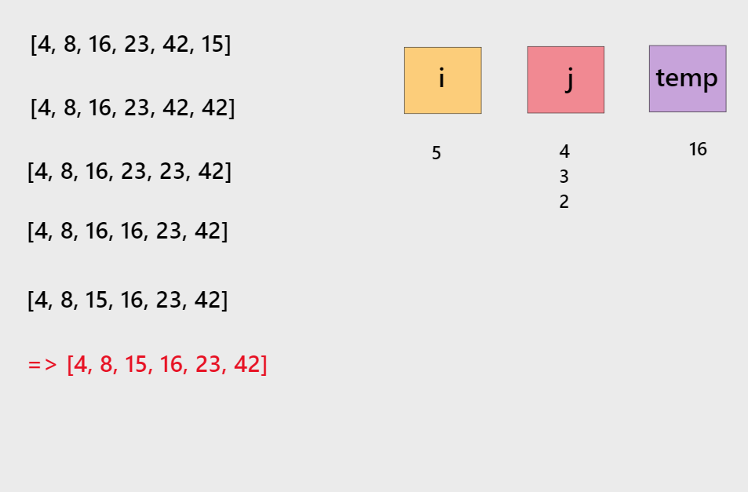

# Insertion Sort

## Pseudocode

    InsertionSort(int[] arr)  

    FOR i = 1 to arr.length  

      int j <-- i - 1  
      int temp <-- arr[i]  

      WHILE j >= 0 AND temp < arr[j]  
        arr[j + 1] <-- arr[j]  
        j <-- j - 1  

      arr[j + 1] <-- temp  

## Trace

Sample Array : [8, 4, 23, 42, 16, 15]

* Pass 1:   
  
* Pass 2:  
  
* Pass 3:  
  
* Pass 4:    
  
* Pass 5:  
  

## Big O Notation 
* Time : O(n^2)
* Space: O(1)
