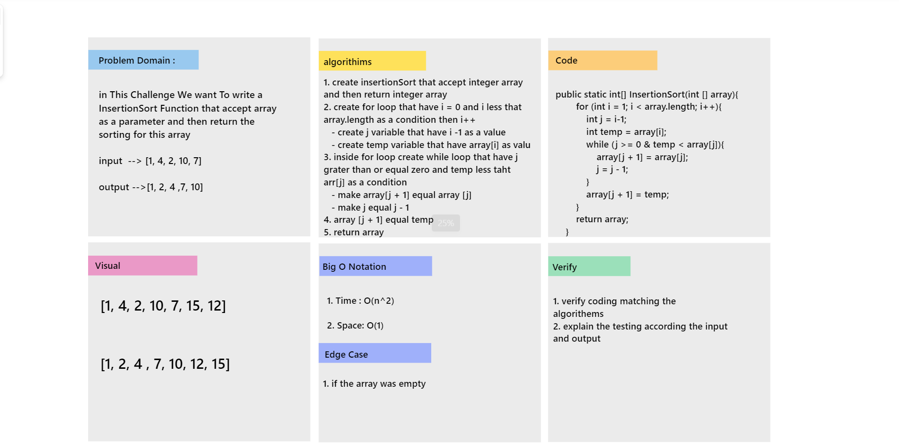

# Challenge Summary

Review the Insertion Sort pseudocode below, then trace the algorithm by stepping through the process with the provided sample array. Document your explanation by creating a blog article that shows the step-by-step output after each iteration through some sort of visual.

## Whiteboard Process

## Blog Article

[BLOG.md](BLOG.md)
___

## Approach & Efficiency

* Big O Notation :
    1. Time : o(n^2)
    2. Space: O(1)

## Solution

* Example :  
     public static void main(String[] args) {  
        int [] num = {1, 3, 2, 5, 4};  
        int [] arr = InsertionSort(num);  
        for (int i = 0; i < arr.length ; i++){  
            System.out.print(arr[i]);  
        }  
    }  

    public static int[] InsertionSort(int [] array){  
        for (int i = 1; i < array.length; i++){  
            int j = i-1;  
            int temp = array[i];  
            while (j >= 0 & temp < array[j]){  
                array[j + 1] = array[j];  
                j = j - 1;  
            }  
            array[j + 1] = temp;  
        }  
        return array;  
    }  
* Output :  
    1 2 3 4 5 

___