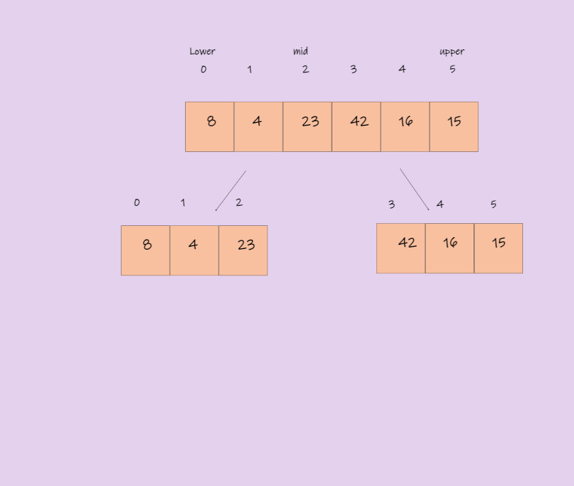
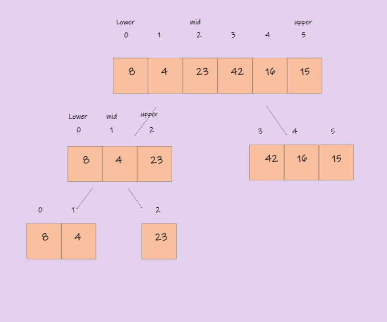
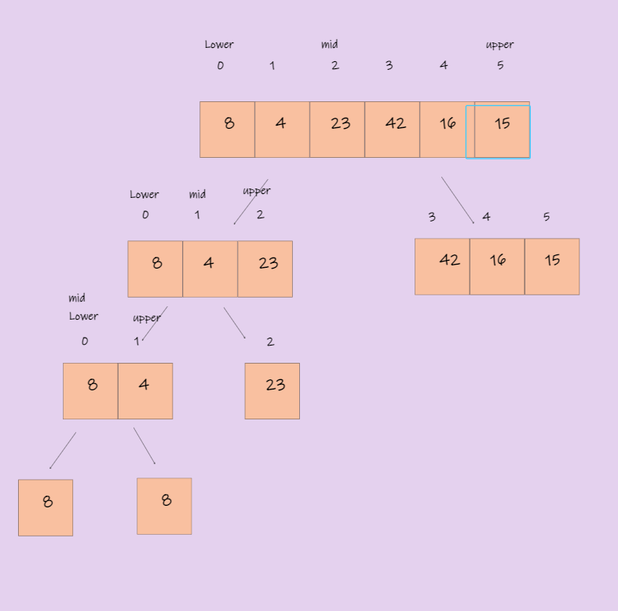
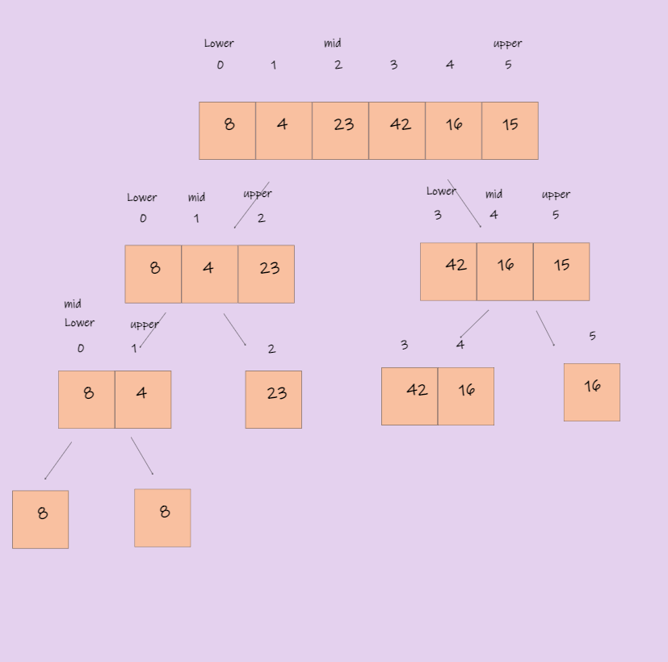
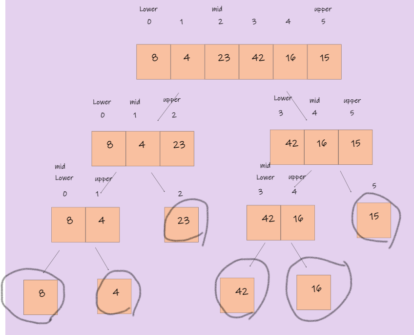
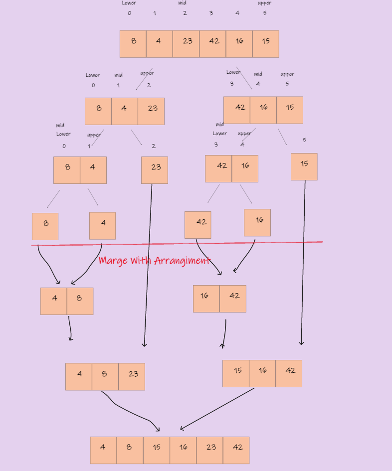

# Insertion Sort

## Pseudocode

    ALGORITHM Mergesort(arr)  
    DECLARE n <-- arr.length  

    if n > 1  
      DECLARE mid <-- n/2  
      DECLARE left <-- arr[0...mid]
      DECLARE right <-- arr[mid...n]
      // sort the left side
      Mergesort(left)
      // sort the right side
      Mergesort(right)
      // merge the sorted left and right sides together
      Merge(left, right, arr)

ALGORITHM Merge(left, right, arr)
    DECLARE i <-- 0
    DECLARE j <-- 0
    DECLARE k <-- 0

    while i < left.length && j < right.length
        if left[i] <= right[j]
            arr[k] <-- left[i]
            i <-- i + 1
        else
            arr[k] <-- right[j]
            j <-- j + 1

        k <-- k + 1

    if i = left.length
       set remaining entries in arr to remaining values in right
    else
       set remaining entries in arr to remaining values in left

___

## Trace

Sample Array : [8, 4, 23, 42, 16, 15]

* Pass 0:   

* in this step when we call the MargeSort( arr, 0, 5)
in this method will divide our array to two array
the left array is start from 0-2 and the secound is start from 3-5

___

* Pass 1:  
  
* in this step when we call the MargeSort( left, 0, 2)
in this method will divide our array to two array
the left array is start from 0-2 and the secound is just the 2 index

___

* Pass 2:  
  
* in this step when we call the MargeSort( left, 0, 1)
in this method will divide our array to two array
the left array is 0 index and the secound is just the 1 index
and after every array has one element we will stop to divide it and move to the right side

___

* Pass 3:    
 
* in this step when we call the MargeSort( right, 3, 5)
in this method will divide our array to two array
the left array from 3-4 index and the secound is just the 5 index

___

* Pass 4:
  
* in this step when we call the MargeSort( right, 3, 4)
in this method will divide our array to two array
the left array is 3 index and the secound is just the 4 index
and when the all array contain of just one element we will to marge all of single array with us

___

* final pass :  
  
* in this step when we call the Marge(array, lower, mid, upper)
in this method will marge tow array together with arrangement way

___

## Big O Notation

* Time : O(nlogn)
* Space: O(nlogn)