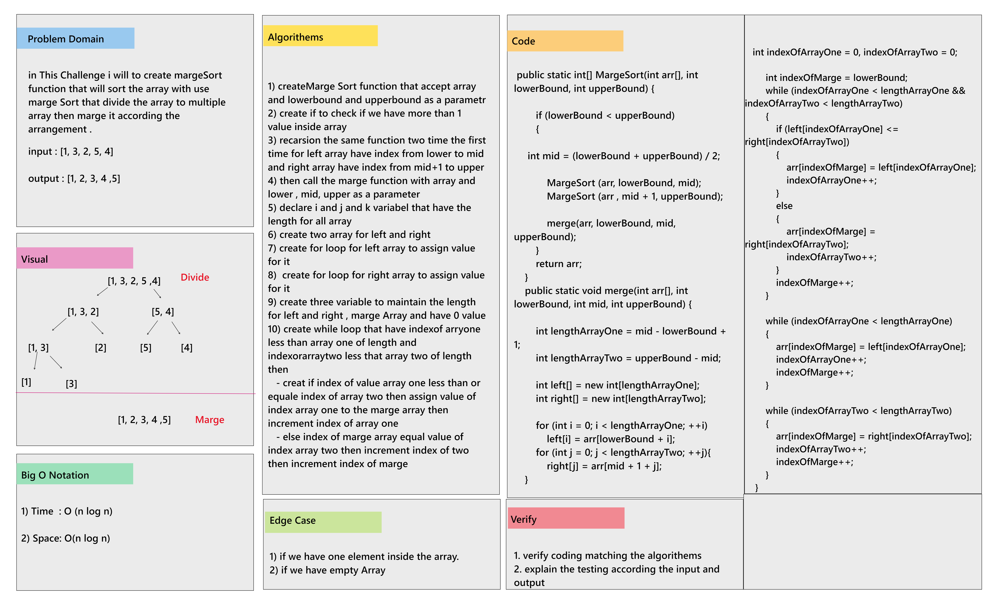

# Challenge Summary

Review the Marge Sort pseudocode , then trace the algorithm by stepping through the process with the provided sample array. Document your explanation by creating a blog article that shows the step-by-step output after each iteration through some sort of visual.

___

## Whiteboard Process

## Blog Article

[BLOG.md](BLOG.md)
___

## Approach & Efficiency

* Big O Notation 
    1. Time : O(n log n)
    2. Space: O(n log n)

___

## Solution

* Example :  
    int [] arr  = {1, 4, 5, 2, 3};  
    int [] arr2 = MargeSort (arr, 0, arr.length - 1);  

    // Print Array that produced from MargeSort function  
    for (int i = 0; i < arr2.length; i++){  
        System.out.print(arr2[i]);  
    }  
* Output :  
    "1 2 3 4 5"

___
