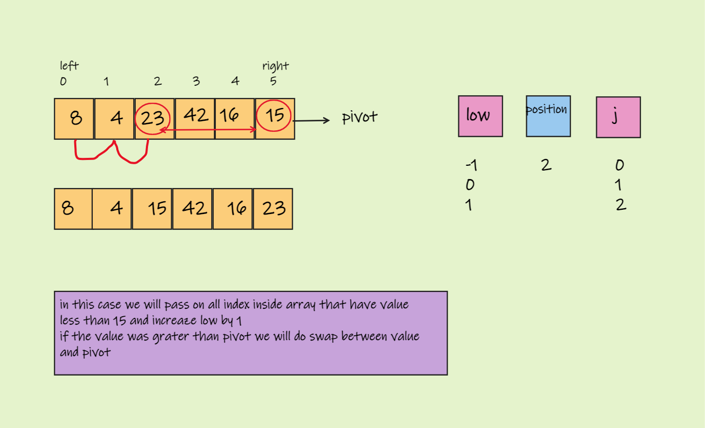
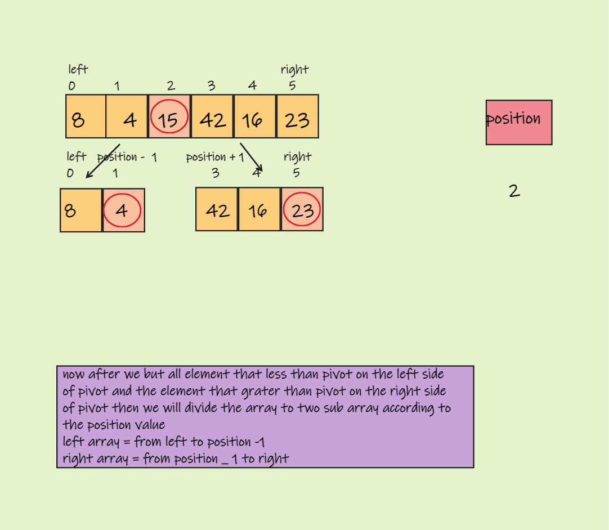
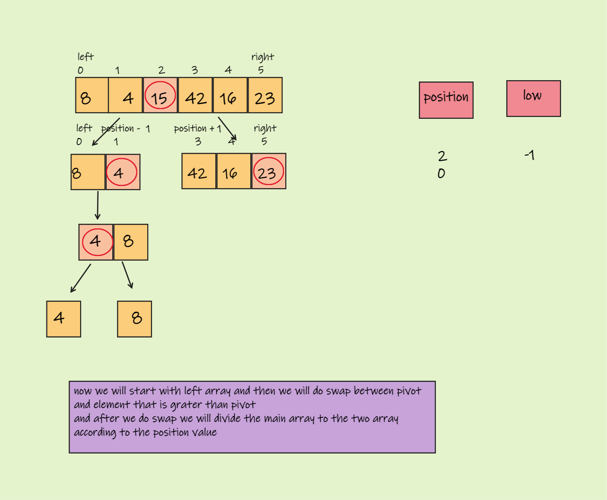
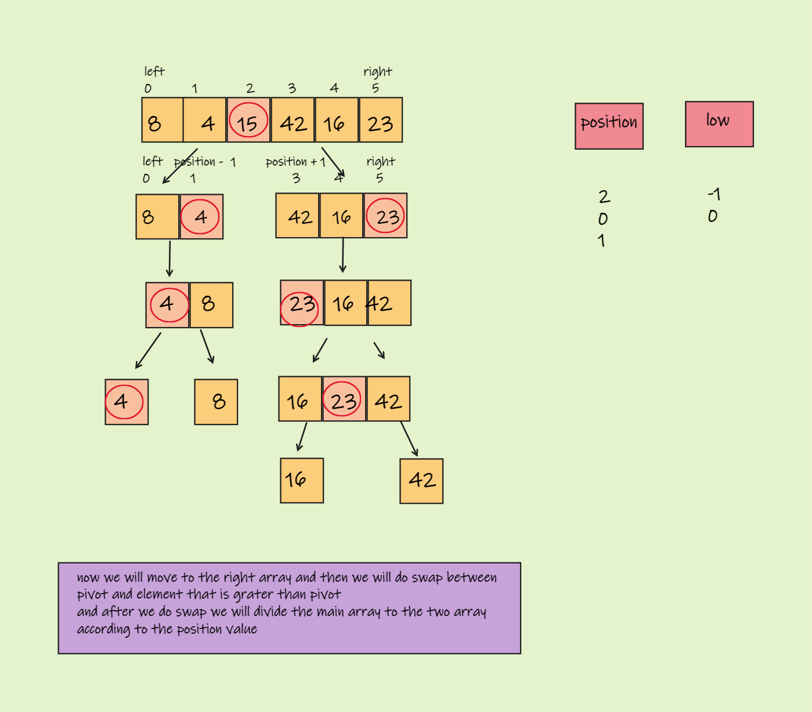
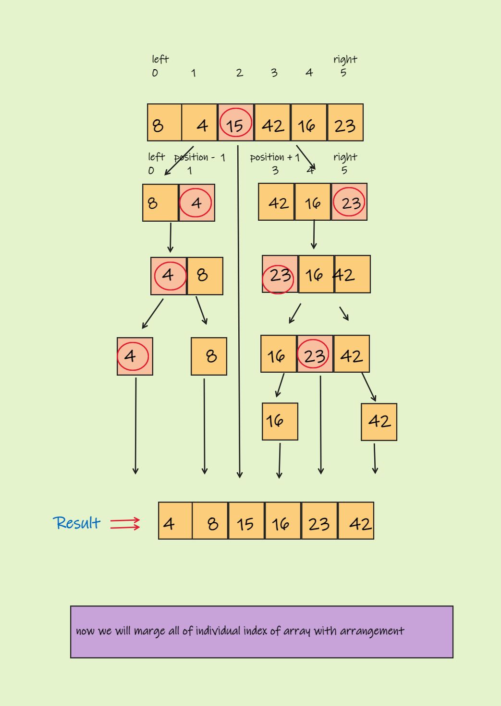

# Quick Sort

## Pseudocode

ALGORITHM QuickSort(arr, left, right)  
    if left < right  
        DEFINE position <-- Partition(arr, left, right)  
        QuickSort(arr, left, position - 1)  
        QuickSort(arr, position + 1, right)  
  
ALGORITHM Partition(arr, left, right)  
    DEFINE pivot <-- arr[right]  
    DEFINE low <-- left - 1  
    for i <- left to right do  
        if arr[i] <= pivot  
            low++  
            Swap(arr, i, low)  

    
Swap(arr, right, low + 1)  
    return low + 1  

ALGORITHM Swap(arr, i, low)  
    DEFINE temp;  
    temp <-- arr[i]  
    arr[i] <-- arr[low]  
    arr[low] <-- temp  

___

## Trace

* Pass 1 :  
     
___ 

* Pass 2 :  
     
___

* Pass 3 :  
     
___ 

* Pass 4 :  
     
___ 

* Finall Pass :  
     
___ 

## Big O Notation

* Time : O(nlogn)
* Space: O(n)