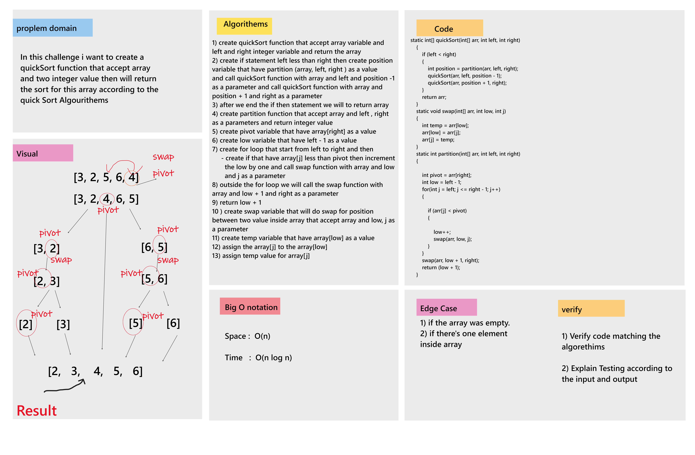

# Challenge Summary

Review the Quick Sort pseudocode , then trace the algorithm by stepping through the process with the provided sample array. Document your explanation by creating a blog article that shows the step-by-step output after each iteration through some sort of visual.

___ 

## Whiteboard

___ 

## Blog Artical

[Blog](BLOG.md)

___

## Approach & Efficiency

* Big O Notation 
    1. Time : O(n log n)
    2. Space: O(n)

___

## Solution

* Example :  
int arr[] = {5, 7, 9, 2, 3};  
int resultArr[] = quickSort(arr, 0, arr.length-1);  
  
    for (int i = 0; i < resultArr.length; i++) {    
        System.out.print(resultArr[i] + " ");  
    }  
* Output : 2 3 5 7 9 