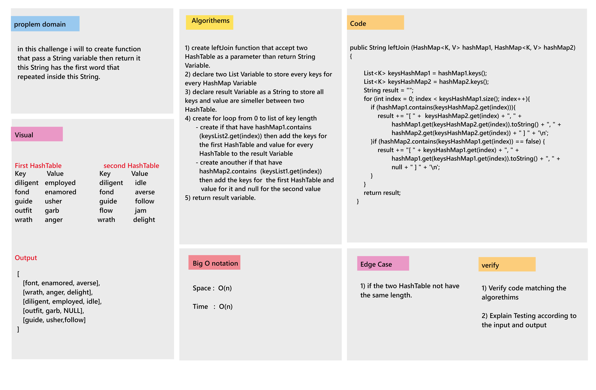

# Hashmap LEFT JOIN

* in this challenge i will to create leftJoin method that will accept two HashMap as a parameter then return String value for all keys and values if the keys inside two HashMap are equal
and null value if the keys are not equal according to the first HashMap "Left Join "

## Whiteboard Process

## Approach & Efficiency

* ### Approach

  * in this challenge i will to create HashTable and Node Classes then i will to create anouther class that called Algorithm to create repeted method inside it.
  * inside thie algorithm class i will to create leftJoin method inside it that will accept two HashMap as parameter than return String variable.

* ### Efficiency

  * Big O Notation :
    * Time : O(n).
    * Space: O(n).

## Solution

* Example :  
    HashMap<String, String> hashMap1 = new HashMap<>();  
    HashMap<String, String> hashMap2 = new HashMap<>();  

    Algorithm algorithm = new Algorithm();  

    hashMap1.set("1", "11");  
    hashMap1.set("2", "22");  
    hashMap1.set("3", "33");  
    hashMap2.set("1", "1");  
    hashMap2.set("2", "4");  
    hashMap2.set("4", "9");  

* Output :  
    [ 2, 22, 4 ]  
    [ 3, 33, 9 ]  
    [ 1, 11, null ]  
