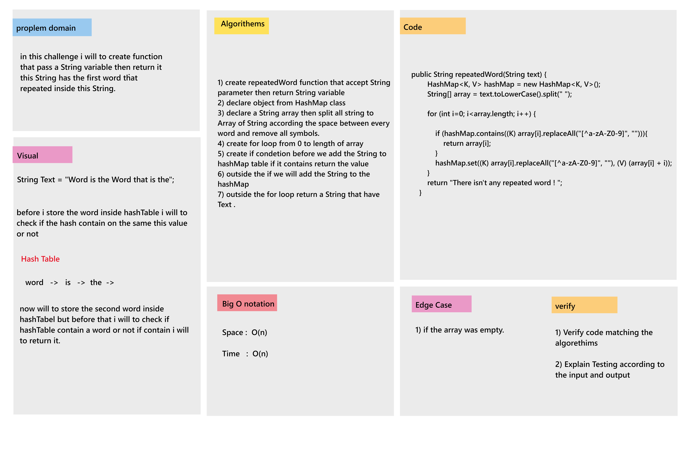

# Challenge Summary

* In this challenge i will to create repeatedWord method that will accept a String argument then will return the first word repeted inside this String. 

## Whiteboard Process

## Approach & Efficiency

* ### Approach

    * in this challenge i will to create HashTable and Node Classes then i will to create anouther class that called Algorithm to create repeted method inside it.
    * inside this class i will to distribure the String variable inide String array to check about the first repeted word inside this String Variable.

* ### Efficiency

    * Big O Notation : 
        - Time : O(n).
        - Space: O(n).

## Solution

* Example :  
    Algorithm algorithm = new Algorithm();  
    String text = "Once upon a time, there was a brave princess who..."; 
    System.out.println(text);

* output :  
    a
