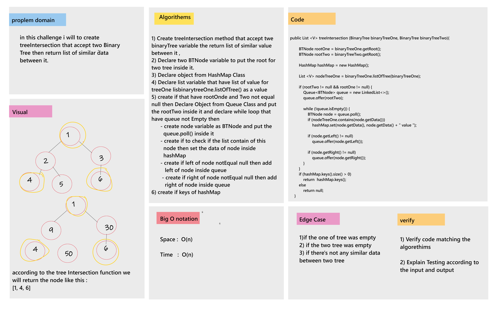

# Challenge Summary

* in this challenge i will to create treeIntersection that accept two Binary Tree then return list of similar data between it.

## Whiteboard Process

## Approach & Efficiency

* int this challenge i will to create some class : 
    - create HashTable Class
    - Create HahsNode Class to assign value for hashTale
    - Create BinaryTree class and BTNode Class to assign value for binary Tree.
    - after that i will to create treeIntersection method insdie Algorithm class.
* Big O notation : 
    1. Space: O(n).
    2. Time : O(n).

## Solution
* Example :  
     
        BinaryTree binaryTreeOne = new BinaryTree();  
        binaryTreeOne.setRoot(new BTNode(1));  
        binaryTreeOne.getRoot().setLeft(new BTNode(2));  
        binaryTreeOne.getRoot().setRight(new BTNode(3));  
        binaryTreeOne.getRoot().getLeft().setLeft(new BTNode(4));  
        binaryTreeOne.getRoot().getLeft().setRight(new BTNode (5));  
        binaryTreeOne.getRoot().getRight().setLeft(new BTNode(6));  
        binaryTreeOne.getRoot().getRight().setRight(new BTNode(7));  

        System.out.println("Binary Tree One : ");  
        binaryTreeOne.levelOrderTraversalLoop();  
        System.out.println();

        // ******** Binary Tree Tow **************
        BinaryTree binaryTreeTwo = new BinaryTree();  
        binaryTreeTwo.setRoot(new BTNode(10));  
        binaryTreeTwo.getRoot().setLeft(new BTNode(2));  
        binaryTreeTwo.getRoot().setRight(new BTNode(5));  
        binaryTreeTwo.getRoot().getLeft().setLeft(new BTNode(4));  
        binaryTreeTwo.getRoot().getLeft().setRight(new BTNode (3));  
        binaryTreeTwo.getRoot().getRight().setLeft(new BTNode(8));  
        binaryTreeTwo.getRoot().getRight().setRight(new BTNode(1));  

        System.out.println("Binary Tree Two");  
        binaryTreeTwo.levelOrderTraversalLoop();  
        System.out.println();  

        System.out.println("Similar Between two Tree");  
        System.out.println(algorithm.treeIntersection(binaryTreeOne, binaryTreeTwo));  
* Output :  
    Binary Tree One :   
    1 => 2 => 3 => 4 => 5 => 6 => 7 =>   
    Binary Tree Two  
    10 => 2 => 5 => 4 => 3 => 8 => 1 =>   
    Similar Between two Tree  
    [1, 2, 3, 4, 5]  