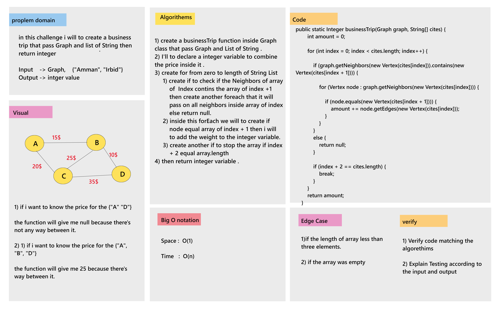

# Challenge Summary

* In this challenge i will to create a business trip that pass Graph and list of String then retunr integer value this value is the coset of wrod wrad between the list of cities

___

## Whiteboard Process

___

## Approach & Efficiency

### Approach 

1. i need to create Edge and Vertex , Graph Class .
2. then i cann to write a busineesTrip function inside Graph Class.

### Efficiency 

* Big O Notation : 
    1. Time : O(n).
    2. Space: O(n).

___

## Solution

### Example : 

graph.addNode("Amman");  
graph.addNode("Jara");  
 graph.addNode("Ajl");  
 graph.addNode("Aqa");  
graph.addNode("Zar");  
graph.addNode("Irb");  

graph.addEdge(new Vertex("Amman"), new Vertex("Jara"), 150);  
        graph.addEdge(new Vertex("Amman"), new Vertex("Ajl"), 82);  
        graph.addEdge(new Vertex("Ajl"), new Vertex("Jara"), 99);  
        graph.addEdge(new Vertex("Ajl"), new Vertex("Aqa"), 42);  
        graph.addEdge(new Vertex("Jara"), new Vertex("Aqa"), 105);  
        graph.addEdge(new Vertex("Jara"), new Vertex("Zar"), 26);  
        graph.addEdge(new Vertex("Jara"), new Vertex("Irb"), 37);  
        graph.addEdge(new Vertex("Aqa"), new Vertex("Zar"), 73);  
        graph.addEdge(new Vertex("Zar"), new Vertex("Irb"), 250);  

System.out.println(graph.businessTrip(graph, new String[]{"Amman","Ajl",  "Aqa"})  );  

### Output 
124

___
