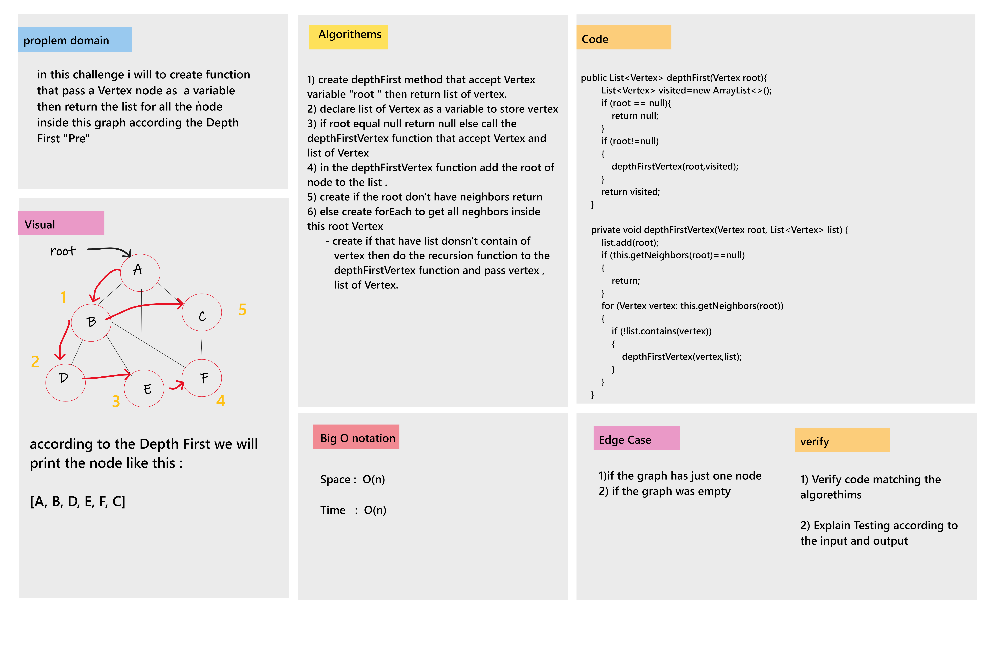

# Depth First Traversal

* in this challenge i will to create function that pass a Vertex node as  a variable then return the list for all the node inside this graph according the Depth First "Pre"

___

## Challenge Whiteboard

___

## Approach & Efficiency

* Approach :  
    - Create Graph and Vertex Class.
    - then Create depthfirst function that pass a Vertex then return the list for all the Vertex according to the Depth First "Pre".
* Efficiency :  
    - Big O Notation : 
        1. Time : O(n).
        2. Space: O(n).

___

## Solution

* Example :  
    Graph graph = new Graph();  
    graph.addNode("A");  
    graph.addNode("B");  
    graph.addNode("C");  
    graph.addNode("D");  
    graph.addNode("F");  

    graph.addEdge(new Vertex("A"), new Vertex("B"));  
    graph.addEdge(new Vertex("A"), new Vertex("C"));  
    graph.addEdge(new Vertex("B"), new Vertex("D"));  
    graph.addEdge(new Vertex("D"), new Vertex("F"));  

    System.out.println(graph.depthFirst(new Vertex("B")));  
* Output :  
    [B, A, C, D, F]

___
