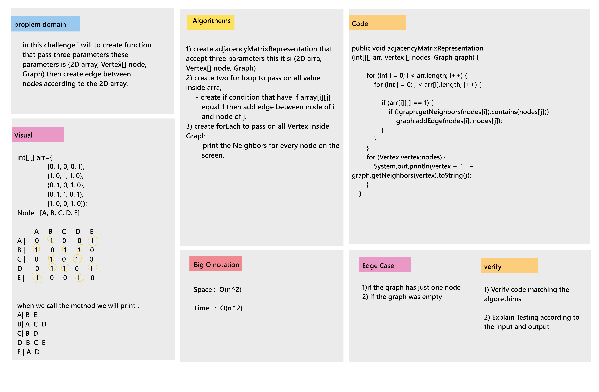

# Challenge

* in this challenge i will to create function that pass three parameters these parameters is {2D array, Vertex[] node, Graph} then create edge between nodes according to the 2D array.

## WhiteBoard

