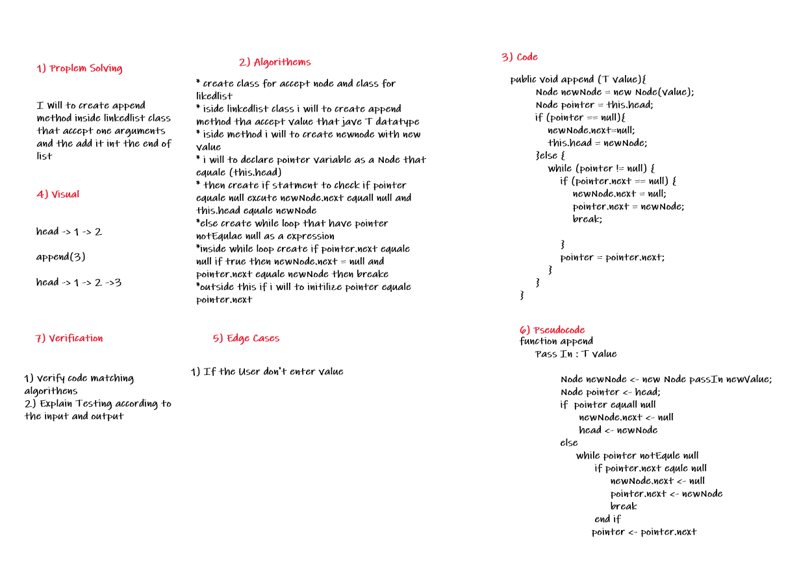
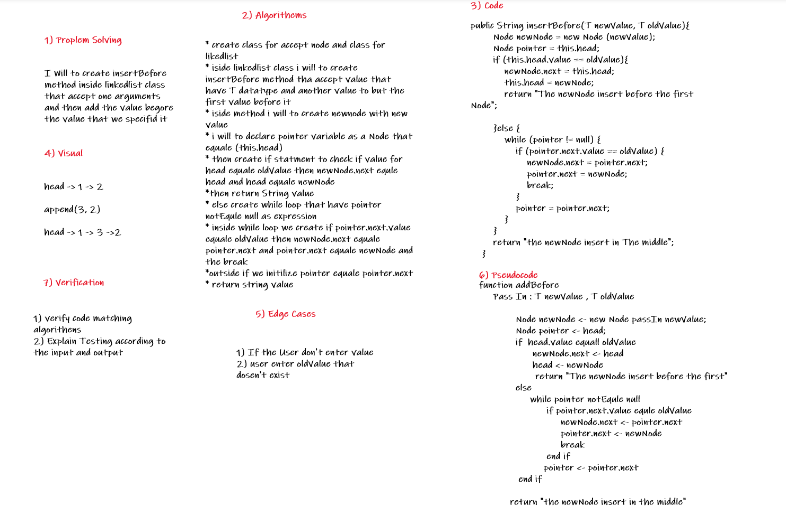
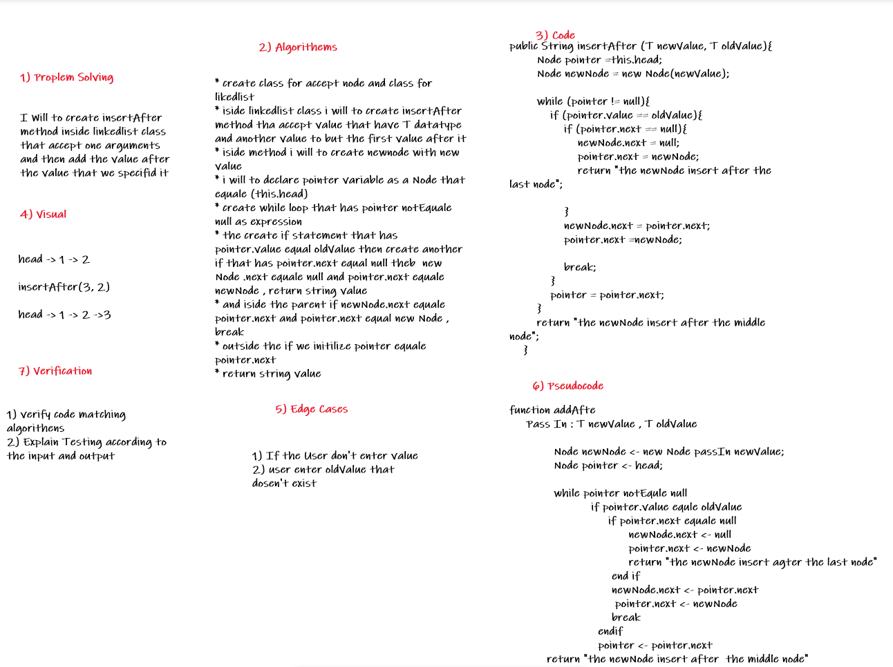

# Challenge Summary
we want to write a programme that have linkedlist class to append and insert after any value and insert before any value on this linkedlist

# Whiteboard Process
## Append Method 

## InsertBefore Method

## InsertAfter Method

## Approach & Efficiency
append Method => o(n)  
insertBefore Method => o(n)  
insetAfter Method => o(n)  

## Solution
LinkedList <Integer> linkedList = new LinkedList<>();  
        linkedList.append(3);  
        linkedList.append(4);  
        linkedList.append(6);  
        System.out.println(linkedList.insertBefore(9,3));  

        linkedList.printItems();  
Output   
9  
3  
4  
6

