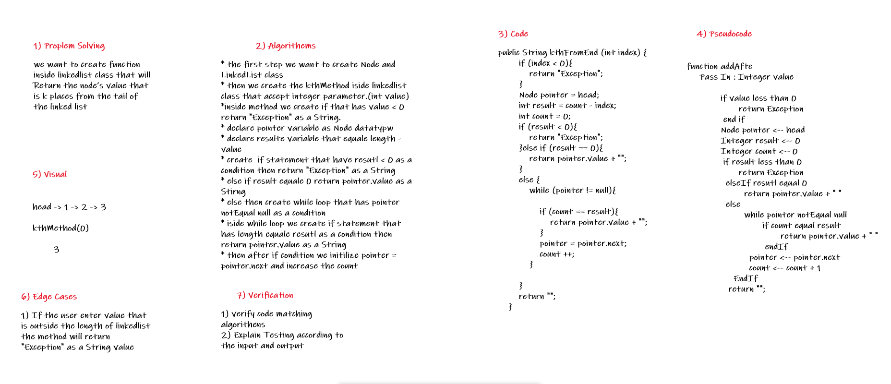

# Challenge7 Summary
in this challenge we created th kthFromEnd method that accept integer value as a parameter then return the value that has same this index from the end of LinkedList.

## Whiteboard Process

___
## Approach & Efficiency

The approach that i take it to solve this challenge is create method iside linkedList class and fitch th length for this linkedList to know what is the value that is require to fitch it.  
Big o => O(n)
___
## Solution
## Example
LinkedList <Integer> linkedList = new LinkedList();  
        linkedList.addNode(1);  
        linkedList.addNode(2);  
        linkedList.addNode(3);  
        linkedList.addNode(4);  
        linkedList.printItem();  
       System.out.println(linkedList.kthFromEnd(0));    
## output  
        will return the last value is (4)
